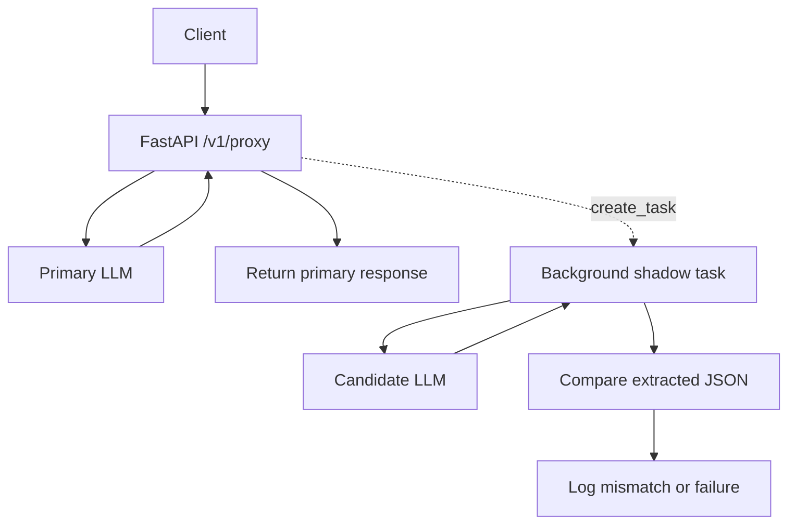

# Proxy

FastAPI skeleton for a synchronous primary LLM proxy with asynchronous candidate shadow execution.

## Project structure

```text
app/main.py                  FastAPI app setup and startup/shutdown lifecycle.
app/routes.py                HTTP routes: health, hello, proxy, simulated LLMs.
app/settings.py              Default URLs and timeout settings.
app/schemas.py               Request/response data shapes using Pydantic.
app/services/llm_client.py   Small async HTTP client wrapper.
app/services/shadow.py       Background candidate call and output comparison.
app/utils/json_extract.py    Helper for extracting JSON from LLM-style text.
tests/                       Unit tests for JSON extraction and shadow logging.
requirements.txt             Runtime Python dependencies.
requirements-dev.txt         Runtime plus test dependencies.
Dockerfile                   Container image definition for deployment.
Makefile                     Common local run, test, and Docker commands.
.github/workflows/ci.yml     GitHub Actions test, build, and publish workflow.
pyproject.toml               Project metadata and test configuration.
```

## Key functions

- `lifespan()` in `app/main.py`: creates shared settings, HTTP client, and background task tracking.
- `health()` in `app/routes.py`: returns `{"status": "ok"}` for a setup check.
- `hello()` in `app/routes.py`: returns `{"message": "hello world"}` for a simple route check.
- `proxy_to_primary()` in `app/routes.py`: calls the primary LLM, starts candidate shadow comparison, returns primary response.
- `simulated_primary()` / `simulated_candidate()` in `app/routes.py`: fake LLM endpoints for local testing.
- `LLMClient.post()` in `app/services/llm_client.py`: sends JSON with `httpx` and returns parsed JSON.
- `run_shadow_comparison()` in `app/services/shadow.py`: calls candidate LLM and logs a warning if output differs.
- `extract_json_payload()` in `app/utils/json_extract.py`: parses JSON from dicts, lists, raw strings, fenced code, or embedded text.

## Architecture flow



The solid path is synchronous: `/v1/proxy` waits only for the Primary model and
returns that response to the caller. The dotted path is decoupled with
`asyncio.create_task`, so Candidate latency or failure is handled after the
Primary response has already been sent.

## Run

```bash
python -m pip install -r requirements.txt
uvicorn app.main:app --host 0.0.0.0 --port 8000 --reload
```

If the server starts but `localhost:8000` does not connect, make sure you are
curling from the same environment where `uvicorn` is running. In VS Code remote
containers or Codespaces, open the **Ports** panel, forward port `8000`, and use
the forwarded URL shown there.

## Useful commands

```bash
python -m pip install -r requirements-dev.txt
curl http://127.0.0.1:8000/health
curl http://127.0.0.1:8000/hello
python -m pytest
```

## Docker deployment

```bash
docker build -t proxy:latest .
docker run --rm -p 8000:8000 proxy:latest
```

With `make`:

```bash
make install-dev
make test
make run
make docker-build
make docker-run
```

The service listens on port `8000` inside the container. After `docker run`,
check it with:

```bash
curl http://127.0.0.1:8000/health
```

## CI/CD

GitHub Actions runs tests on every push and pull request, then builds the Docker
image. When you push a version tag such as `v0.1.0`, the workflow publishes the
image to GitHub Container Registry:

```bash
git tag v0.1.0
git push origin v0.1.0
```

## Example

```bash
curl -X POST http://127.0.0.1:8000/v1/proxy \
  -H 'content-type: application/json' \
  -d '{"prompt":"hello","metadata":{"request_id":"demo-1"}}'
```

The service returns the simulated primary response immediately. It also dispatches a detached candidate request in the background and logs a warning if the extracted JSON payloads differ.
